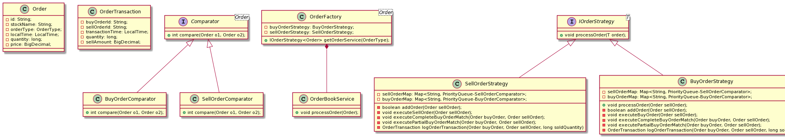

## Table of contents

* [Stock Exchange](#stock-exchange)
* [Design](#design)
    * [Assumptions](#assumptions)
    * [UML Diagram](#uml-diagram)
* [Runbook](#runbook)

### Stock Exchange

### Design

#### Assumptions

1. The Order Matching System does not run continuously and hence will exit after all the orders are
   processed from file, i.e. the system does not run in continuous polling but can be made to run.
2. Since the input file takes only "time", hence there is no provision to validate the future date
   orders and assumes that all orders are placed for same day.
3. The priority Queues are specific to Stock Name, i.e. each Stock will have a queue defined for
   it's stock. This is maintained through Map<StockName, PriorityQueue(Comparator)>

#### UML Diagram

  
   

### Runbook

[Runbook](RUNBOOK.md)

